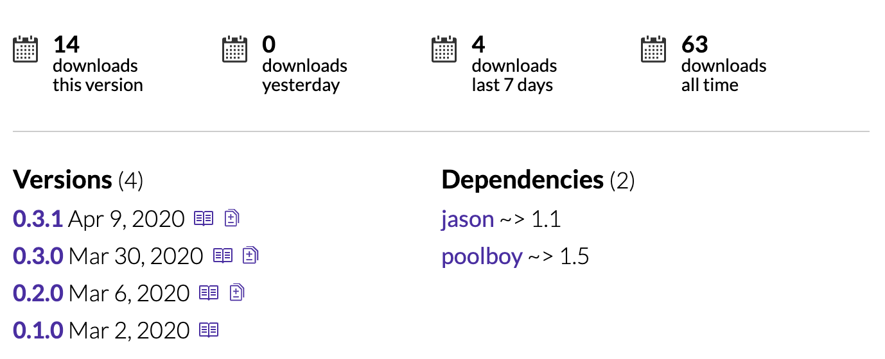
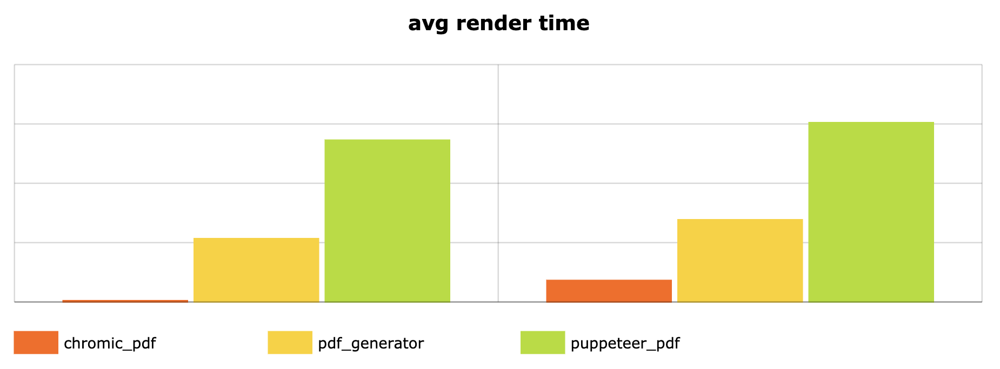
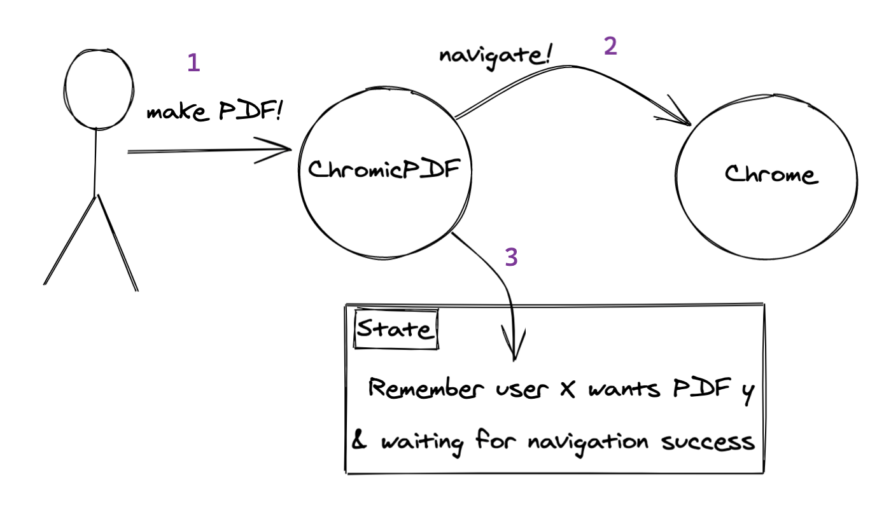
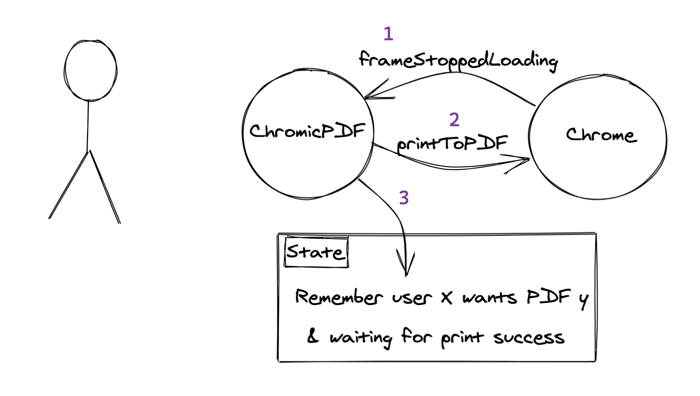
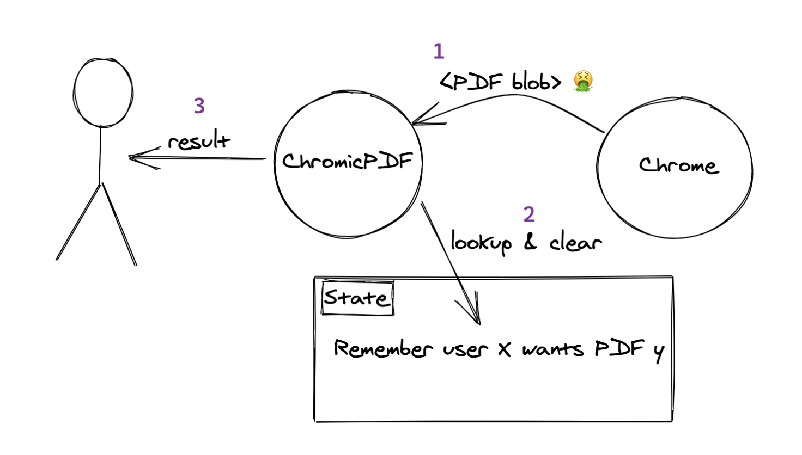
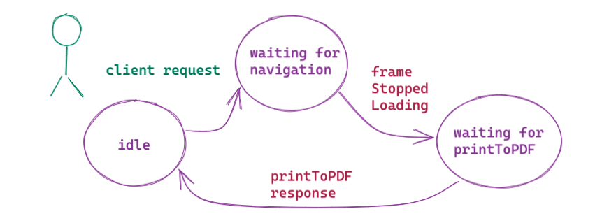

<style>
img[alt~="center"] {
  display: block;
  margin: 0 auto;
}
</style>

<!-- _class: lead -->


---

<!--
- first time doing a talk through remote call, hope the audio is ok
- Headset on, windows closed, but we'll see

- thanks for listening in to this lunch talk
- sorry it took me so long to do it
- talk will be largely technical & focused on the programming
- quick outlook
- It's also going to be looong, approx 1h just me talking
- hope it's bearable
-->

## Hello 👋

---

<!--
our agenda
1. what CPDF actually is, most of you will know by now, but I'll try to summarize it again
2. give you an introduction to the underlying technology
 - namely the protocol that drives Chrome's remote debugging capabilities
3. show how it works in ChromicPDF
 - in this section iteratively develop the PDF printing logic with you
 - this will be long, some code, hopefully understandable
 - BUT IMO interesting, because I think it has now an interesting solution
 - AND it's a problem that I think might be quite common on Erlang / any Actor language

- as said, this will take about 1h
- still, don't hesitate to interrupt
-->

## Agenda

🕐 Brief introduction

🕓 Printing PDFs with Chrome “DevTools”

🕚 Implementation in ChromicPDF


---

<!--
- to start off, here's two screenshots I took (github, hexpm)
- we're going to talk about a little Elixir library that I wrote
- named ChromicPDF, word play on Chrome, also a chemical Chromic acid
- pet project, night work, some paid time thanks to Chris

- as you can see, not much traffic, but I hope to change
- released library beginning of March
- mostly trying to keep the heartbeat alive
- announced on elixirforum, 2 blog posts, Chris twitter
 -->




---

<!--
- SOME BACKSTORY
- motivated by some work we've done the Everyworks project
  where we also had to print PDFs in Elixir
- we wanted to print from HTML
  - which can be controversial
  - we saw a lot of benefits, like we can use familiar tools
- we wanted to use Chrome, because Tessi said wkhtmltopdf has bad render quality

- all major PDF libraries in Elixir land used puppeteer, JS wrapper around Chrome, but we weren't allowed to use NodeJS
- in the end, used command line
  --print-to-pdf

- command line has drawbacks (not all options, wasting resources)
- when I looked at the underlying DevTools protocol
- I thought why not consume the protocol ourselves, in Elixir
- ChromicPdf came to life
-->

## What is it good for?

- Elixir library for rendering PDFs from HTML
- using Chrome headless 🤖
- by implementing parts of the “DevTools” protocol


---

## Why is it cool? 🕶️

<!--
- as mentioned, it supports all options of `printToPDF`
- for example native headers/footers
  - supply h/f templates via the API
  - Chrome repeats these every page, difficult to do in CSS
- Also various other features of the DevTools API, e.g. a new browser context (incognito mode) per target
- BUT NO PUPPETEER

- also faster
- unfair comparison: Other libraries start one Chrome instance per print
- good to see here (1 page vs 20 pages), the raise is almost identical
- main reason is Chrome in background the whole time

- it is AAALSO cool for a variety of other reasons, like nice code, nice tooling & setup, nice documentation, and so on... 
-->

- no puppeteer -> no NodeJS at runtime
- but full feature set of `printToPDF`
- it is faster than the alternatives 🏇



---

<!-- _class: lead -->

# demo time

---

<!--
- any questions so far?
- otherwise going into the DevTools protocl
-->

<!-- _class: lead -->

# DevTools

---

<!--
- first off, give you a walkthrough through what is needed to print a PDF with DevTools
- starting with the protocol basics, 
- then commands
- then flow
STEP
- first launch a Chrome
- Capybara uses a TCP port, has race condition
- Remote debugging pipe! Chrome opens FD 3 & 4
STEP
- gives you a communication channel that speaks JSON:RPC
- uncompressed, async, bidirectional
- messages can be interleaved
- SUM UP: relatively simple protocol
-->

## DevTools Protocol (1)

* launch Chrome with remote debugging
  - `chrome --remote-debugging-port=9222` 🤔
  - `chrome --remote-debugging-pipe 3<&0 4>&1` 🎉
* communication channel
  - `\0`-terminated messages
  - “enhanced” `JSON:RPC` protocol

---

## DevTools Protocol (2)

<!--
- "call" has a unique id that increments
- "method" and "params"
- paperWidth is in inch
- some commands are targeting browser tabs (external processes)
- response (async) has same "id" and "result"

- there are also "notifications" which lack an "id"
- as it is bidirectional, there are theoretically also remote calls; yet Chrome never send me any
- NOTABLY: "sessionId" extension (not JSON:RPC) which denotes the Chrome tab
-->


```text
{
  "id": 5,
  "method": "Page.printToPDF",
  "params": { "paperWidth": 8.26772 },
  "sessionId": "AAABBBCCCDDD"
}
```

```text
{
  "id": 5,
  "result": { "data": "<base64>" }
}
```

---

## DevTools Protocol (3)

<!--
- rough outline of all necessary steps until PDF is printed
- first slide: Commands to create and initialize a target
- createTarget returns targetId
- attachToTarget returns (inspector) sessionId
- both need to be remembered
- Page.enable enables page notifications
-->

```text
 -> {id: 0, method: "Target.createTarget"}
<-  {id: 0, result: {targetId: "..."}
 -> {id: 1, method: "Target.attachToTarget", params: {"targetId": "..."}}
<-  {id: 1, result: {sessionId: "..."}

 -> {id: 2, method: "Page.enable", sessionId: "..."}
<-  {id: 2, result: {}}
```

---

<!--
- on this slide all sessionId params are omitted
- navigate target to URL
- wait for notification frameStoppedLoading
- send printToPDF command
- wait for response
-->

## ...

```text
 -> {id: 3, method: "Page.navigate", params: {url: "..."}}
<-  {id: 3, result: {}}

<-  {method: "Page.frameStartedLoading"}
<-  {method: "Page.frameNavigated"}
...
<-  {method: "Page.frameStoppedLoading"}

 -> {id: 4, method: "Page.printToPDF", params: ...}
<-  {id: 4, result: {data: "<base64-encoded PDF>"}}
```

---

<!--
- any questions so far?
- otherwise going into the code

- now going to show you how this is implemented in ChromicPDF
- by showing some code iterations I had in there
- focus on the second part, just the navigating/printing
-->

<!-- _class: lead -->

# into the code

---

## Challenges ⚔️

<!--
- this sounds relatively simple, yet it took me a while to get right in the implementation
- hence emphasize a few challenges
STEP
- async
- need to keep the user waiting
- need to wait for call responses
- sometimes need to wait for notifications
STEP
- while waiting, need to remember what we're waiting for
- frameId: sometimes multiple frames, we want the "master" frame
-- this will be important soon
STEP
- so we need to make sure communication of target A does not interfere with target B
- session pool

-->

* everything is asynchronous 🦋
* intermediary state 📝
  - last call id
  - but also other data, like current `frameId`
* Do we want multiple targets? 🎯
  - Communication multiplexed on the same channel
  - `sessionId` becomes relevant at some point
  - out of scope for our example

---

<!--
- visualize the process again
- so we all are on the same page
- largely simplify the reality here
- actually 2 "operations": 1. spawn target, 2. print PDF; this is just part 2
-->



---



---

<!--
- this is very basic flow
- ChromicPDF does more (set cookie, clear history for security, etc.)
- focus on this to demonstrate a cool implementation detail in ChromicPDF, namely Protocol
-->



---

<!--
- a solution that automatically comes to mind: GenServer
- due to active component in BEAM that controls chrome
- is what I did as well
- wanted to show you some problems that is has, difficulties to face when using
-->

## How to implement this in Elixir?

`GenServer` is the new fat controller


---

<!--
- code that I had in a similar way
- be patient, read through it together
- omitting a bunch of stuff
  - initialization / connection
  - message sending
  - message parsing tokenization / decoding
  - error handling
  - target creation (first part of before)
  - multiple targets / requests in parallel -> assume there is only one
- a lot of the code will be pseudo code
-->

```elixir
defmodule Browser do
  use GenServer
  
  def handle_call({:print, url, params}, from, state) do
    send_msg_to_chrome(state.conn, :navigate, url)
    {:noreply, %{state | params: params, from: from, step: :navigate}}
  end
  
  def handle_info({:result, %{"frameId" => frameId}}, %{step: :navigate} = state) do
    {:noreply, %{state | frame_id: frame_id}}
  end
  
  def handle_info({"frameStoppedLoading", %{"frameId" => x}, %{frame_id: x} = state) do
    send_msg_to_chrome(state.conn, :print_to_pdf, state.params)
    {:noreply, %{state | step: :print}}
  end
  
  def handle_info({:result, %{"data" => data}}, %{step: :print} = state) do
    GenServer.reply(state.from, data)
    {:noreply, reset_state(state)}
  end
  
  def handle_info(_, state), do: {:noreply, state}
end
```

---

<!--
- as you can tell, this quickly grows out of hand
- main GenServer knows too much
  - communication with Chrome
  - communication with Client
  - protocol steps
-->


---

<!--
- code structure improved
- however, GenServer leaks into Protocol ("from", "connection")
- complexity is the same
-->

```elixir
defmodule Browser do
  def handle_info(msg_from_chrome, state) do
    new_state = Protocol.process(msg_from_chrome, state)
    {:noreply, new_state}
  end
end

defmodule Protocol do
  def process(...) do
    # same logic
    # possibly send a message to Chrome (connection is in state)
    # possibly send GenServer reply to client (from is in state)
    # return updated state
  end
end
```

---

<!--
- neat trick Andi came up with
- send msg to self
- this way Protocol doesn't need to know
  - how to send messages to Chrome
  - or how to respond to the client (not shown)
-->

```elixir
defmodule Browser do
  # same logic
  
  def handle_info({:send_msg_to_chrome, msg}, state) do
    send_msg_to_chrome(state.conn, msg)
    {:noreply, state}
  end
end

defmodule Protocol do
  def process(%{"frameStoppedLoading", ...}, state) do
    send(self(), {:send_msg_to_chrome, {:print_to_pdf, state.params}})
  end
end
```

🎉🥳

---

<!--
- I'm showing this particular logic because it took me quite a few iterations to be satisfied with it
- Generalized problem:
STEP
- protocol logic is still tied to the GenServer
- new process clauses: They'll all be tried, and code structure wise it's not good
- need some way of dynamic dispatch
STEP
- also lots of boilerplate that needed to be eliminated
STEP
- it occurred to me, I would like to code the protocol flow in an imperative fashion
- do this, wait for that
- basically like JavaScript `async/await`
-->

## *sigh* 😩

* adding new `process/2` clauses doesn't scale
   - real implementation has 8 calls and 10 steps
* lots of boilerplate everywhere, not DRY
  - matching messages & steps
  - sending calls
  - updating state
*  prefer to write it in an “imperative” style

---

<!--
- this is not Elixir
- not even sure if possible, even with macros
- as you have to suspend execution/reduction of a function
-->

## JS meets Elixir

```elixir
%{"frameId" => frame_id} =
  await send_msg_to_chrome({:navigate, url})

await notification("frameStoppedLoading", frame_id)

%{"data" => data} =
  await send_msg_to_chrome({:print_to_pdf, params})
```


---

<!--
- we need to get rid of the protocol details from the GenServer (infrastructure)
- find a good abstraction for it
-->

## Abstract away the protocol 💡

---

<!--
- This is like a state machine. Events come in, state changes, actions emitted
- hence we can represent it as data
STEP
- the GenServer only knows to execute the state machine, but doesn't know its "program"
-->

## Abstract away the protocol 💡

- Protocol flow is like a state machine.



* Build a processor for it and keep the “program” in data.

---

<!--
- Soo this is what I built
- "FSM" probably misused term, didn't look it up, but it seemed fitting
- the protocol is a linear list of steps to process, a call followed by an await, etc.
- this is our representation of a single "operation" on the Browser module
- it has its own state (a simple map) and stores its own client origin

- WITH THIS: what we can do, we can start a new operation by initializing a list of functions
- pass it to the Browser module which keeps it in its state and forwards messages to them

- NOTE: this is just one representation, there would be multiple valid representations
- also for more complex interactions, it's not sufficient
- real code: very simple control flow with a conditional step that can then skip sections
-->

## Functional State Machine (1)

```elixir
@type protocol :: %{
      steps: [step()],
      state: state(),
      from: GenServer.from()
    }

@type state :: map()
@type step :: call_step() | await_step()
```

---

<!--

- call_fun: gets a "dispatch" function that encapsulates the "upstream" communication
- can also alter the state (they sometimes do)

- await_fun: is not allowed to dispatch
- but can alter the state on match (for storing response data)

- dispatch: a function that receives "call" data and returns the last call id for storing
-->

## Functional State Machine (2)

```elixir
@type call_step :: {:call, call_fun()}
@type call_fun :: (state(), dispatch() -> state())
```

```elixir
@type await_step :: {:await, await_fun()}
@type await_fun :: (state(), message() -> :no_match | {:match, state()})
```

```elixir
@type dispatch :: (JsonRPC.call() -> JsonRPC.call_id())
```

---

## Functional State Machine (3)

<!--
- this is our PROCESSOR
- or an overly simplified version of it

- when a message arrives, the first function step on the queue is always an await
- if matches, is popped from queue
- if not, it remains

- then all "call" steps are processed until another await is up top
-->

```elixir
def run(protocol, msg, dispatch) do

  protocol
  
  |> apply_await_fun_and_pop_if_matches(msg)
  
  |> process_and_pop_call_funs_until_next_await(dispatch)
  
  |> reply_if_no_more_steps()
  
end
```

---

<!-- _backgroundColor: #dbdbdb -->


---

<!--
- this is going to be a bit rough
- these macros define functions (call funs or await funs)
- then add them to a list
- so technically this syntax is just sugar for a list of functions

- the macros are basically helpful because a lot of the steps are similar
- e.g. wait for the response and fetch some value
- Macros aren't required here, could do this with normal functions
- at this point I wanted to code like JavaScript
-->

## With the help of some macros

This is actually how the code looks. Almost.

```elixir
call("Page.navigate", [:url])

await_response(["frameId"])

await_notification("Page.frameStoppedLoading", ["frameId"])

call("Page.printToPDF", [:opts])

await_response(["data"])

call("Page.navigate", %{"url" => "about:blank"})
```

---

<!--
- here's the Browser
- with support for multiple "protocols" / operations in parallel
- simply sends incoming messages to all protocols
- remove protocols that don't have any more steps
-->

```elixir
defmodule Browser do
  def handle_call({:run_protocol, protocol}, from, state) do
    protocols =
      [Protocol.init(protocol, from, state.dispatch) | state.protocols]
      
    {:noreply, %{state | protocols: protocols}}
  end

  def handle_info({:chrome_msg, msg}, state) do
    protocols =
      run_protocols_and_remove_finished(
        state.protocols, &Protocol.run(&1, msg, dispatch)
      ) 
      
    {:noreply, %{state | protocols: protocols}}
  end
end
```

---

<!-- 
- we're through, we made it
- WHY I think this is cool
STEP
- first off, GenServer has very limited knowledge now
- can be dynamically told how operations work
- doesn't need to change when we change protocol
STEP
- wrt. "functional" state machine
- would have been possible without function steps (eg just primitives)
- then the processor becomes more complex
- with functions, this logic is inside them
- MACROS help sharing code
- custom implementations are possible
STEP
- lbnl new protocol steps are trivial to add
- no surprise with so much boilerplate :)
- added screenshot capturing in no time
-->

## Benefits of this design


* GenServer is ignorant of the protocol details 🎉
* many “step” functions are alike, some are different
* adding new protocol steps / protocols is easy

---

<!--
- quite likely there are better ways
- probably not the best in PERFORMANCE
- this was FUN to build
-->

## Benefits of this design

- GenServer is ignorant of the protocol details 🎉
- many “step” functions are alike, some are different
- adding new protocol steps / protocols is easy

there are a million other (probably better) ways to solve this

---

<!-- _class: lead -->

# summing up

---

## ChromicPDF

- it was fun building it
- maybe it's useful for somebody
- take a 👀 at the code

https://github.com/bitcrowd/chromic_pdf

---

## Further plans

- keep a pulse so people don't think it's dead
- otherwise 🤷‍♂️
  - fun idea 1: connect it to LiveView
  - fun idea 2: assisted templating (e.g. DIN5008)


---

<!-- _class: lead -->

# 🙏

`@xhr15` `@andreasknoepfle` `@nickgnd` `@klappradla` `@lwassermann` `@planktonic` `@tessi` and others

---

# Questions?

## 🦉

